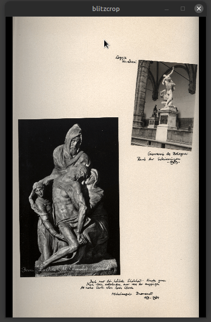

# blitzcrop

[](https://pypi.python.org/pypi/blitzcrop)
[](https://github.com/luphord/blitzcrop/actions)

GUI for interactive **batch image cropping**:

1. Drag along the diagonal of the image from *upper left* to *lower right* corner and release the mouse button.
2. Move the mouse to the upper right corner and click.
3. Accept or reject the cropped image in the dialog popping up.



## Features
* Batch crop large amounts of images in a short amount of time
* Drag and click to crop an image
* Crop *rotated* images
* Pass images via command line
* Navigate between images using `left arrow`/`right arrow`  or `A`/`D`
* Accept cropped images by `Enter` or `Space` and reject them by `Esc`

## Install

You can install `blitzcrop` using `pip` with

```bash
pip3 install blitzcrop
```

Alternatively, you can download `blitzcrop.py` and then run it using `python3` with

```bash
python3 blitzcrop.py
```

In this case, you need to ensure that [Pillow](https://pillow.readthedocs.io) is installed in your system and available to `python3`.

## History

### 0.2.0 (2022-10-09)
* Implement core cropping interaction with drag + click
* Support multiple images via command line arguments
* Support basic keybindings for image navigation and crop accept / reject

### 0.1.0 (2022-04-03)
* Created using [cookiecutter-pyscript](https://github.com/luphord/cookiecutter-pyscript)

## Credits

Main developer is luphord <luphord@protonmail.com>. [cookiecutter-pyscript](https://github.com/luphord/cookiecutter-pyscript) is used as project template.
